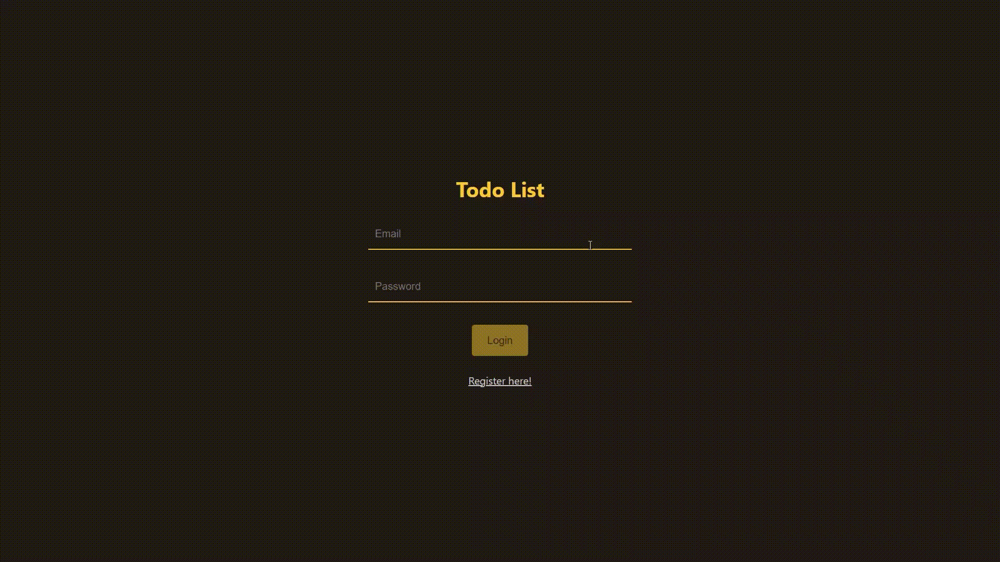
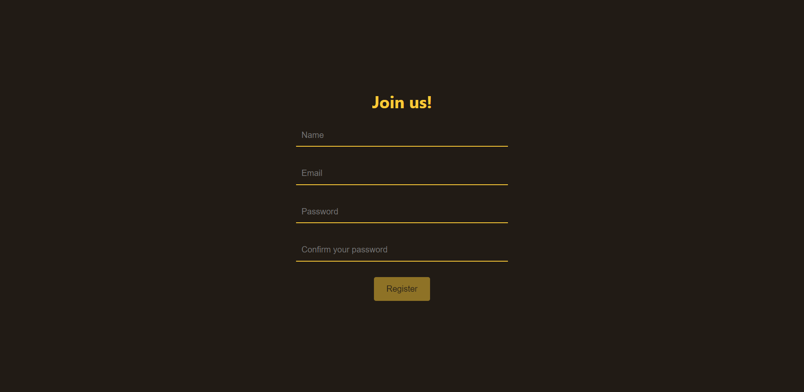
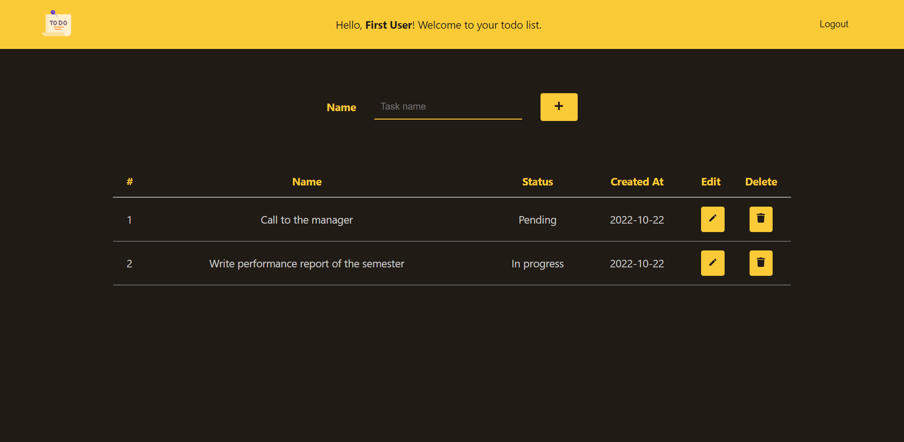

# Todo List 📝

Este é o projeto Fullstack de uma lista de tarefas onde pessoas usuárias podem realizar **cadastro e login** bem como **c**riar, **l**er, **a**tualizar e **d**eletar (**CRUD**) suas tarefas.

O projeto foi desenvolvido num *monorepo* (um único repositório) contento a implementação do back-end, front-end e dos containers de desenvolvimento da aplicação.



## Sumário

- [Containers]
- [Back-end]
- [Front-end]
- [Deploy]

## Containers

O projeto utiliza Docker Compose para orquestrar múltiplos containers de desenvolvimento.

Ao todo, foram utilizados 3 containers, sendo eles:

- `db`: serviço do banco de dados da aplicação.
- `api`: serviço da API da aplicação.
- `ui`: serviço da interface da pessoa usuária com a aplicação.

As particularidades e dependências de cada container podem ser vistas no arquivo [docker-compose.yml].

## Back-end

O back-end do projeto é formado pelo banco de dados, que armazena os dados das pessoas usuárias e suas tarefas, e pela API, que controla o acesso ao banco de dados a partir de requisições feitas no front-end.

### Banco de dados

O banco de dados utilizado é o `MySQL`, um banco relacional. Essa escolha foi feita porque usuários e tarefas, as entidades trabalhadas na aplicação, possuem um relacionamento fundamental entre si.

As tabelas do banco, Users e Tasks, têm relacionamento 1:N e possuem os seguintes atributos:

#### Users

| id | name | email | password |
| ----------- | ----------- | ----------- | ----------- |
| integer | string | string | string |

- `id`: identificador único da pessoa usuária.
- `name`: nome da pessoa usuária.
- `email`: email único da pessoa usuária.
- `password`: senha da pessoa usuária.

#### Tasks

| id | name | status | user_id | created_at
| ----------- | ----------- | ----------- | ----------- | ----------- |
| integer | string | string | integer | date |

- `id`: identificador único da tarefa.
- `name`: nome da tarefa.
- `status`: status da tarefa (Pendente, Em progresso ou Pronta).
- `user_id`: identificador único da pessoa usuária a qual a tarefa pertence.
- `created_at`: data de criação da tarefa.

### API

A API é RESTful (segue as restrições da arquitetura REST) e foi desenvolvida em `Node.js` com a arquitetura MSC (Model, Service, Controller) para separação de responsabilidades.

#### Tecnologias

As tecnologias utilizadas para desenvolver a API foram:

- `Express`: para construir o servidor da API.
- `Joi`: para validar os dados enviados à API.
- `Cors`: para liberar o acesso à API.
- `Json Web Token`: para gerar e validar tokens de acesso usados em endpoints da API.
- `Sequelize`: para mapear as entidades do banco de dados em objetos.
- `Md5`: para gerar o hash das senhas das pessoas usuárias que serão guardados no banco de dados.

#### Documentação

Para ver os endpoints da API e o formato de requisição para cada um deles, acesse a [documentação da API](https://documenter.getpostman.com/view/20099081/2s7YfGDcum).

## Front-end

O front-end do projeto é formado pela interface da pessoa usuária. Essa interface é uma SPA (Single Page Application) e permite que a pessoa interaja com a aplicação para realizar cadastro ou login e gerenciar suas tarefas.

### Tecnologias

As tecnologias utilizadas para desenvolver a interface da pessoa usuária foram:

- `React`: para construir a interface da pessoa usuária.
- `Axios`: para fazer requisições à API.
- `Local Storage`: para armazenar o token de acesso e nome da pessoa usuária.
- `Context API`: para criar o estado global da interface da pessoa usuária.
- `Styled Components`: para estilizar a interface da pessoa usuária.

### Páginas

#### Login

Página inicial onde a pessoa usuária pode realizar login na aplicação.

Caso sejam enviados dados de login (email e senha) inválidos, uma resposta visual é exibida na tela. Quando o login é feito com sucesso, a pessoa é redirecionada à página das tarefas.

Ao acessar esta página, caso haja um token válido armazenado no local storage, a pessoa é redirecionada automaticamente para a página das tarefas.


#### Register

Página onde a pessoa usuária pode se cadastrar para usar a aplicação.

Caso sejam enviados dados de cadastro (email, nome e senha) inválidos, uma resposta visual é exibida na tela. Quando o cadastro é feito com sucesso, a pessoa é redirecionada à página das tarefas.



#### Tasks

Página onde a pessoa usuária pode ver todas as suas tarefas, além de editá-las, deletá-las e criar novas.

Nesta página é possível também fazer o logout da aplicação, redirecionando a pessoa para a página de login logo em seguida.

Caso a pessoa tente acessar diretamente esta página sem estar autenticada, ela é redirecionada automaticamente para a página de login.



## Deploy

⚙️ O deploy da aplicação será disponibilizado em breve.

## Executando o projeto

### Pré-requisitos

⚠️ Para executar o projeto, é necessário:

- Ter o [Docker](https://docs.docker.com/get-docker/) e o [Docker Compose](https://docs.docker.com/compose/) instalados na sua máquina.
- Clonar o este repositório.
- Criar um arquivo `.env` na raiz do projeto, com base no [.env.example](https://github.com/tainnaps/todo-list-full-stack/blob/main/.env.example), definindo os valores de cada variável de ambiente usada.

### Passo a passo

Com os pré-requisitos atendidos, siga os seguintes passos para executar o projeto:

1. Na raiz do projeto, execute o seguinte comando para iniciar os containers da aplicação:

``` bash
docker-compose up 
```

Caso queira iniciar os containers em segundo plano, use o seguinte comando:

``` bash
docker-compose up -d
```

2. Com os containers inicializados, acesse o seguinte endereço no navegador para ver a aplicação rodando:

``` bash
localhost:3000
```

## Executando os testes

### Back-end

Foram feitos testes de integração para cada endpoint da API usando `Mocha`, `Chai`, `Chai-http` e `Sinon`, obtendo 98% de cobertura de testes.

Para executar os testes, siga os seguintes passos:

1. Acesse o terminal do container da API com o comando abaixo:

``` bash
docker exec -it todo-list-api bash
```

2. No terminal do container da API, execute o seguinte comando:

``` bash
npm test

